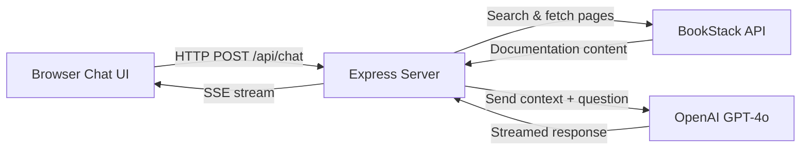

# BookStack AI Chatbot — Web Interface

Build a web-based chatbot that lets users ask questions about their BookStack documentation and get AI-powered answers with source citations.

## Architecture

**RAG (Retrieval-Augmented Generation) approach:**
1. User asks a question
2. Server searches BookStack for relevant pages
3. Server fetches full content of top results
4. Sends the context + question to OpenAI
5. Streams the AI response back to the browser with source links

## Proposed Changes

### Chatbot Web App

All new files in `chatbot/` subfolder — completely separate from the MCP server code.

#### [NEW] `chatbot/package.json`
- Express.js server dependencies
- OpenAI SDK, axios for BookStack API calls
- Dev scripts: `npm run dev`, `npm start`

#### [NEW] `chatbot/server.js`
- Express server on port 3000
- `POST /api/chat` — receives user message, searches BookStack, calls OpenAI, streams response via SSE
- `GET /api/books` — lists available books for the sidebar
- Serves static frontend from `chatbot/public/`
- BookStack API client (simplified version — search + get page)

#### [NEW] `chatbot/public/index.html`
- Premium dark-themed chat interface
- Auto-scrolling message area
- Source citation cards with links to BookStack pages
- Responsive layout

#### [NEW] `chatbot/public/styles.css`
- Glassmorphism design with dark mode
- Smooth animations for messages
- Typing indicator
- Mobile-responsive

#### [NEW] `chatbot/public/app.js`
- Sends messages to the API
- Handles SSE streaming for real-time response display
- Renders markdown in responses
- Displays source cards

#### [NEW] `chatbot/.env`
- `OPENAI_API_KEY` — OpenAI key
- `BOOKSTACK_BASE_URL` — reuse from parent
- `BOOKSTACK_TOKEN_ID` — reuse from parent
- `BOOKSTACK_TOKEN_SECRET` — reuse from parent

#### [NEW] `chatbot/Dockerfile`
- Node.js 20 Alpine container
- Serves the web app on port 3000

---

### Docker Compose Update

#### [MODIFY] `docker-compose.yml`
- Add the `chatbot` service alongside the existing MCP service
- Map port 3000 for browser access

## User Review Required

> [!IMPORTANT]
> Your OpenAI API key will be stored in `chatbot/.env`. Each chat message will make 2-4 API calls:
> - 1 search call to BookStack
> - 1-3 page fetch calls to BookStack
> - 1 call to OpenAI GPT-4o (streaming)
>
> Estimated cost: ~$0.01-0.03 per question depending on context size.

> [!WARNING]
> I will add `chatbot/.env` to `.gitignore` so your API keys are never committed to git.

## Verification Plan

### Automated Tests
- `docker compose up --build` — verify both services start
- Open `http://localhost:3000` in browser
- Send a test question and verify streamed response with sources

### Manual Verification
- Visual check of the chat UI design
- Verify source links point to correct BookStack pages
