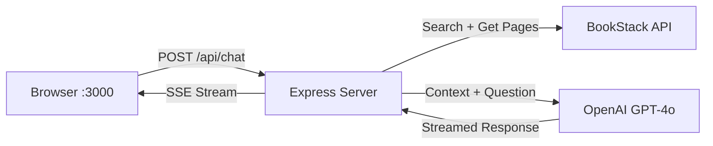

# BookStack AI Chatbot — Walkthrough

## What Was Built

A web-based AI chatbot that searches your BookStack documentation and answers questions using GPT-4o, running in Docker.


## Architecture



## Files Created

| File | Purpose |
|------|---------|
| `chatbot/server.js` | Express server with RAG pipeline |
| `chatbot/public/index.html` | Chat UI with sidebar and welcome screen |
| `chatbot/public/styles.css` | Premium dark theme with glassmorphism |
| `chatbot/public/app.js` | Frontend: SSE streaming, markdown rendering |
| `chatbot/package.json` | Dependencies (Express, OpenAI, axios) |
| `chatbot/.env` | API keys (BookStack + OpenAI) |
| `chatbot/Dockerfile` | Container definition |
| `docker-compose.yml` | Updated with chatbot service |

## How to Use

### Start (Docker)
```powershell
cd c:\Github\BookStack\bookstack-mcp
docker compose up --build chatbot
```

Then open **http://localhost:3000** in your browser.

### Stop
```powershell
docker compose down
```

### Run in Background
```powershell
docker compose up --build chatbot -d
```

## Features
- **RAG Pipeline**: Searches BookStack → fetches page content → sends to GPT-4o
- **Streaming Responses**: Real-time token-by-token display via SSE
- **Source Citations**: Clickable links to relevant BookStack pages
- **Conversation History**: Maintains context across messages (last 6 exchanges)
- **Sidebar**: Lists all available books from your BookStack instance
- **Suggestion Chips**: Quick-start questions on the welcome screen

## Verification
- ✅ Docker builds successfully
- ✅ Server starts and connects to BookStack at `library.zters.com`
- ✅ UI loads with all 15+ books listed in sidebar
- ✅ Connection status shows "Connected to BookStack"
